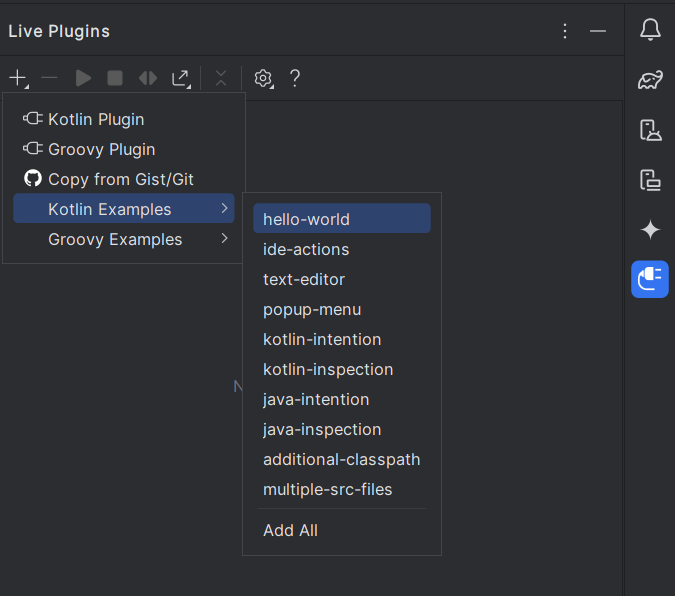
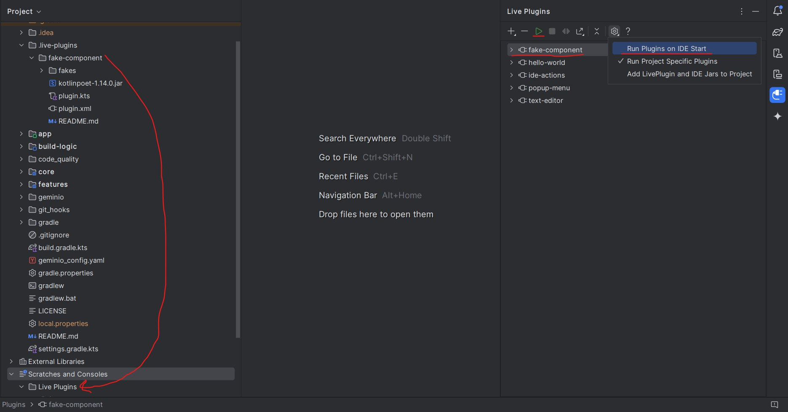
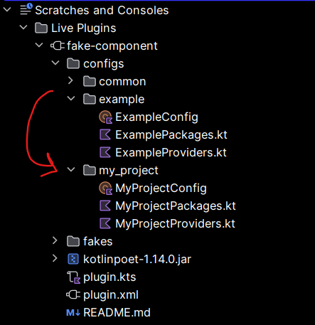
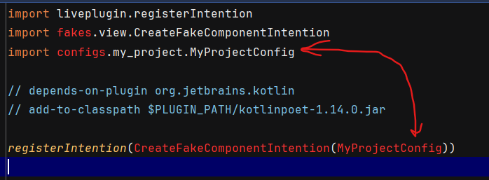
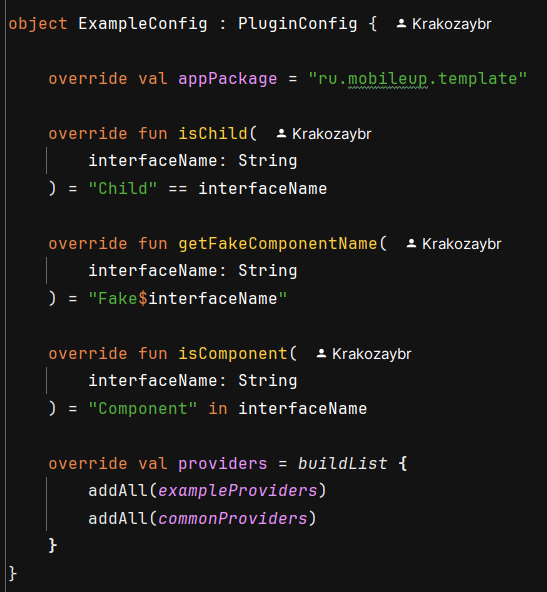

# Плагин для генерации Fake-компонентов

## Установка
1. Установите [liveplugin](https://plugins.jetbrains.com/plugin/7282-liveplugin)
2. Переключитесь в `Project view`
3. В `Scratches and Consoles` должна появиться папка `Live plugins`. 
*Если не появилась, то откройте вкладку плагина и создайте один из примеров (см. скрин), тогда папка появится:  *
4. Скопируйте туда папку `.live-plugins/fake-component`  
5. В списке liveplugin-а появится плагин fake-component, его нужно выделить и запустить по стрелочке,
также можно настроить автоматический запуск всех плагинов при старте ide
6. Далее настраиваем плагин под проект

## Настройка
*Примечание: ide не очень хорошо позволяет производить настройку, но предполагается, что она потребуется лишь единожды*

Для настроек под каждый проект предлагаю создавать папку `configs/<PROJECT-NAME>`.
Просто копируем `configs/example` и переименовываем файлы и сущности для удобства.
 
**ВАЖНО**: Не забудьте поменять `package` в каждом из файлов.

Затем в файле `plugin.kts` заменяем ExampleConfig на конфиг нашего текущего проекта:

В конфигурации для каждого проекта есть три файла:
* `MyProjectPackages` - константы с полными `package-name` до некоторых сущностей
* `MyProjectProviders` - список кастомных правил для конкретного проекта
* `MyProjectConfig` - `object`, хранящий всю конфигурацию. В нём можно задать:
  * стандартный префиксный `package` проекта (поле `appPackage`)
  * функции для определения является ли интерфейс - компонентом/интерфейсом-Child
  * функцию для генерации названия фейк-компонента
  * списки правил для подстановки стандартных значений (поле `providers`)

В `configs/common` можно найти примеры того, как объявлять правила и `package`-константы. `Common`-правила также можно изменять для удобства

Отмечу, что правила просматриваются в прямом порядке, т.е. можно переопределить какое-то `common`-правило специфичным для проекта.
Чтобы такое работало, нужно в объявлении поля `providers` объекта конфигурации, сначала добавить кастомные правила, а затем - `common` (как на скрине)

## Как работает
1. `Alt + Enter -> Generate fake component`
2. Сгенерировать фейк-компонент можно (т.е. появляется подсказка) при следующих условиях:
    * класс, на который применяется плагин - интерфейс
    * его имя содержит в себе строку `"Component"` (`MyProjectConfig.isComponent` возвращает `true`)
    * интерфейс - верхнеуровневая сущность в файле (т.е. он не вложен ни в какую другую)
3. Далее генерируется класс-наследник интерфейса, в котором переопределяются поля и методы, у которых нет стандартной реализации в интерфейсе.
Если тип содержит в себе generic-и, то возможна их отдельная обработка, если такая логика содержится в объявляющем их правиле.
Например, по умолчанию `StateFlow<StateFlow<Int>>` превратится в `MutableStateFlow(MutableStateFlow(0))`.
А вот `List<Int>` превратится в `listOf()`. Конечно, всё это можно изменить.

## Какие типы поддерживает
По умолчанию идёт поддержка примитивов, `StateFlow`, `LoadableState`, `PagedState`, `InputControl`, `CheckControl`, `ChildStack`, `StandardDialogControl`-а, некоторых коллекций и вложенных компонентов

## Ограничения
1. liveplugin на данный момент не работает с kotlin 2.0.0, так что убедитесь, что режим K2 выключен
2. Т.к. плагин содержит в себе внушительное количество логики, её пришлось разбить на файлы. Однако, пока что адекватной поддержке code completion для нескольких файлов нет. Вот [issue](https://github.com/dkandalov/live-plugin/issues/105)
3. Не рекомендуется использование typealias-ов как прямых, так и при импорте. Вообще может работать и с ними, но это корнер кейс, пока что полной поддержки он не получил
4. Плагин может плохо работать в случаях, когда package не объявлен (в обычном проекте package всегда есть и содержит хотя бы 3 родителя, так что это тоже такой корнер кейс)
