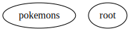

# MobileUp Android Template 🌀

Hi! This is a template for initializing an Android project in [MobileUp](https://mobileup.ru/).

## Creating Project

After cloning the template:

1. Replace `ru.mobileup.template` with the package name of your project.
2. Replace application name and icon to the correct ones.
3. Remove the pokemons feature. It is created as an example.
4. Replace error text resources with text for your project.

## Modules
The project is based on three gradle modules:

#### app
It pieces all the features together, contains `Application` and `Activity` classes. Also all tests are placed here.

#### core
It contains general purpose things: error handing, message showing, network, theme, utils, reusable widgets.

#### features
It consists of concrete features. Each feature has its own package which contains:
- DI configuration
- **ui layer** - components, Jetpack Compose UI
- **domain layer** - entities, interactors
- **data layer** - repositories, storages

## Features structure

## Technology stack
- [Jetpack Compose](https://developer.android.com/jetpack/compose) - UI
- [Decompose](https://github.com/arkivanov/Decompose) - componentization and navigation
- [Replica](https://github.com/aartikov/Replica) - organizing of network communication
- [Sesame](https://github.com/aartikov/Sesame) - architecture components: [form validation](https://github.com/aartikov/Sesame/tree/master/sesame-compose-form)
- [Koin](https://github.com/InsertKoinIO/koin) - Dependency Injection
- [Ktor](https://ktor.io/) - Network
- [Ktorfit](https://github.com/Foso/Ktorfit) - network requests in Retrofit way
- [Coroutines](https://developer.android.com/kotlin/coroutines) - asynchronous operations
- [Kotlin Serialization](https://github.com/Kotlin/kotlinx.serialization) - JSON serialization and parsing
- [Coil](https://github.com/coil-kt/coil) - image loading
- [Detekt](https://github.com/detekt/detekt) - static code analysis
- [Hyperion](https://github.com/willowtreeapps/Hyperion-Android) - debug panel
- [Robolectric](https://github.com/robolectric/robolectric) - unit testing
- [Module Graph Gradle Plugin](https://github.com/MobileUpLLC/Module-Graph-Gradle-Plugin) - feature dependency graph visualization and validation

### Git hooks

1. Run detekt static code analysis and module graph validation before commit. Installation: 

`cp git_hooks/pre-commit .git/hooks/ && chmod 0775 .git/hooks/pre-commit`

2. Add issue prefix in every commit message according to branch name. Replace `YOUR_ISSUE_PREFIX` with your issue prefix:

`sed 's/ISSUE_PREFIX_NAME/YOUR_ISSUE_PREFIX/g' git_hooks/prepare-commit-msg > .git/hooks/prepare-commit-msg && chmod 0775 .git/hooks/prepare-commit-msg`

### Good coding and happy day!🤘
