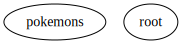

# MobileUp Android Template 🌀


Hi! This is a template for initializing an Android project in [MobileUp](https://mobileup.ru/).

## Creating Project

After cloning the template:

1. Run the setup script to configure your application ID and JIRA key:  
   `./scripts/setup-project <new.application.id> <JIRA_PROJECT_KEY>`
2. Update `AGENTS.md` for your concrete product context.
3. Replace application name and icon with project-specific assets.
4. Remove the demo `pokemons` feature and related wiring.
5. Replace error text resources with product text.
6. Build a project-specific `CustomTheme` and reusable widget set in `core`.
7. Continue with product feature implementation.

Notes:
- `setup-project` also runs Git history reset and hook setup scripts.
- If needed separately, history reset script is: `./scripts/reset-git-history`.

## Modules
The project is based on three gradle modules:

#### app
It pieces all the features together, contains `Application` and `Activity` classes.

#### core
It contains general purpose things: error handing, message showing, network, theme, utils, reusable widgets.

#### features
It consists of concrete features. Each feature has its own package which contains:
- DI configuration
- **ui layer** - components, Jetpack Compose UI
- **domain layer** - entities, queries, pure functions
- **data layer** - repositories, storages

## Features structure


## Technology stack
- [Jetpack Compose](https://developer.android.com/jetpack/compose) - UI
- [Decompose](https://github.com/arkivanov/Decompose) - componentization and navigation
- [Replica](https://github.com/aartikov/Replica) - organizing of network communication
- [Koin](https://github.com/InsertKoinIO/koin) - Dependency Injection
- [Ktor](https://ktor.io/) - Network
- [Ktorfit](https://github.com/Foso/Ktorfit) - network requests in Retrofit way
- [Moko Resources](https://github.com/icerockdev/moko-resources) - string resources without `Context`
- [Coroutines](https://developer.android.com/kotlin/coroutines) - asynchronous operations
- [Kotlin Serialization](https://github.com/Kotlin/kotlinx.serialization) - JSON serialization and parsing
- [Kotlinx DateTime](https://github.com/Kotlin/kotlinx-datetime) - date/time models
- [Coil](https://github.com/coil-kt/coil) - image loading
- [DataStore](https://developer.android.com/topic/libraries/architecture/datastore) - local key-value storage
- [Security Crypto](https://developer.android.com/topic/security/data) - secure storage primitives
- [Detekt](https://github.com/detekt/detekt) - static code analysis
- [Hyperion](https://github.com/willowtreeapps/Hyperion-Android) - debug panel
- [Module Graph Gradle Plugin](https://github.com/MobileUpLLC/Module-Graph-Gradle-Plugin) - feature dependency graph visualization and validation

### Git hooks
To install the Git hooks for commit checks and automatic issue prefixes, simply run:

`./scripts/setup-git-hooks`

### Geminio templates - creates boilerplate code
1. Read installation instruction root/geminio/SETUP.MD
2. Read user instruction  root/geminio/HOW_TO_USE.MD

### Compose detekt rules docs
https://mrmans0n.github.io/compose-rules/

### Good coding and happy day!🤘

## License
```
MIT License

Copyright (c) 2023 MobileUp

Permission is hereby granted, free of charge, to any person obtaining a copy
of this software and associated documentation files (the "Software"), to deal
in the Software without restriction, including without limitation the rights
to use, copy, modify, merge, publish, distribute, sublicense, and/or sell
copies of the Software, and to permit persons to whom the Software is
furnished to do so, subject to the following conditions:

The above copyright notice and this permission notice shall be included in all
copies or substantial portions of the Software.

THE SOFTWARE IS PROVIDED "AS IS", WITHOUT WARRANTY OF ANY KIND, EXPRESS OR
IMPLIED, INCLUDING BUT NOT LIMITED TO THE WARRANTIES OF MERCHANTABILITY,
FITNESS FOR A PARTICULAR PURPOSE AND NONINFRINGEMENT. IN NO EVENT SHALL THE
AUTHORS OR COPYRIGHT HOLDERS BE LIABLE FOR ANY CLAIM, DAMAGES OR OTHER
LIABILITY, WHETHER IN AN ACTION OF CONTRACT, TORT OR OTHERWISE, ARISING FROM,
OUT OF OR IN CONNECTION WITH THE SOFTWARE OR THE USE OR OTHER DEALINGS IN THE
SOFTWARE.
```